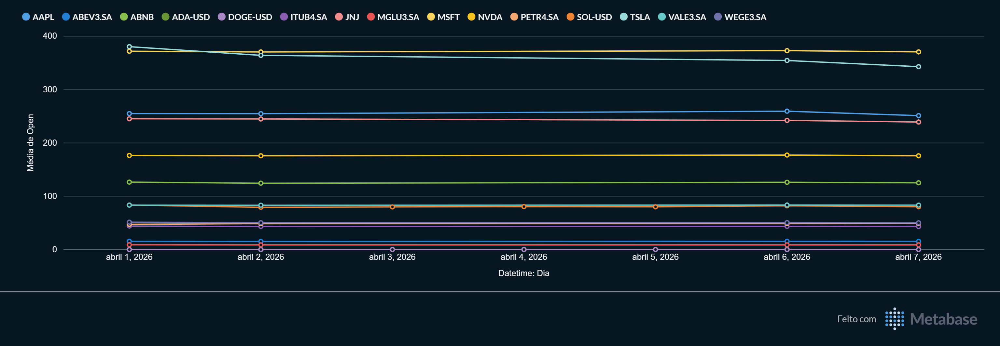
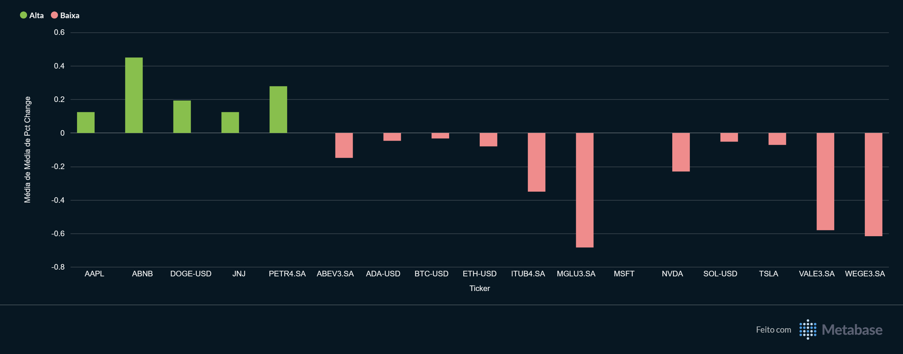
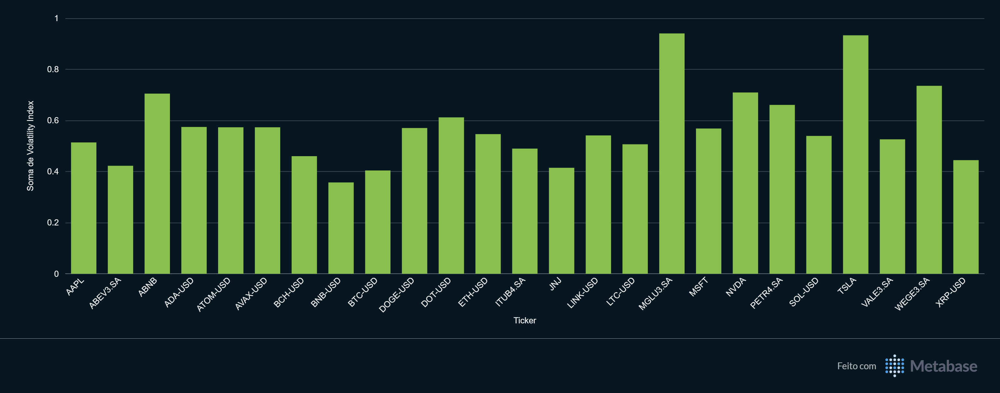
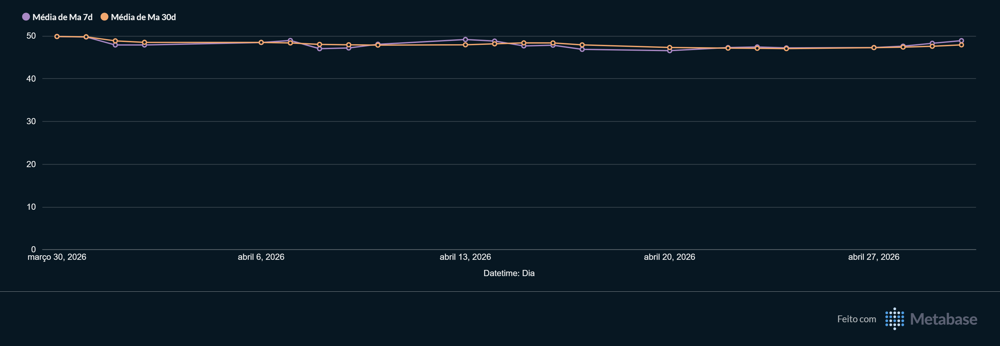

# Pipeline Batch de Monitoramento Financeiro

## Visão geral do projeto

Este projeto implementa um pipeline batch para coleta, armazenamento, transformação e visualização de cotações de ativos financeiros, com foco em ações brasileiras, ações americanas e criptomoedas.

O objetivo principal foi consolidar fundamentos práticos de Engenharia de Dados em um cenário realista de mercado, cobrindo o fluxo completo de dados: extração via API, persistência em banco relacional, orquestração, transformação analítica e consumo em dashboard.

O pipeline foi desenhado com ênfase em:

* **infraestrutura local via código** com Docker Compose
* **ingestão idempotente** com estratégia de upsert
* **orquestração com Apache Airflow**
* **camada analítica com dbt Core**
* **visualização de indicadores no Metabase**

A solução executa coletas recorrentes de mercado, grava os dados no PostgreSQL sem duplicação, transforma a camada bruta em modelos analíticos e disponibiliza métricas como evolução de preço, variação diária, médias móveis e índice de volatilidade.

---

## Objetivos do projeto

* Construir um pipeline batch de ponta a ponta
* Consolidar o uso integrado de Python, PostgreSQL, Airflow, dbt e Metabase
* Garantir idempotência em cargas recorrentes
* Estruturar um projeto de portfólio próximo de uma arquitetura usada no mercado
* Produzir indicadores analíticos a partir de dados financeiros reais

---

## Arquitetura do projeto

### Diagrama ASCII

```text
┌──────────────┐     ┌─────────┐     ┌────────────────────┐     ┌──────────┐
│ APIs de      │────▶│ Airflow │────▶│ PostgreSQL         │────▶│ Metabase │
│ mercado      │     │ (DAGs / │     │ (Raw / Staging /   │     │ (Dashs / │
│ Yahoo /      │     │ Python) │     │ Intermediate /     │     │ BI)      │
│ CoinGecko)   │     └────┬────┘     │ Marts)             │     └──────────┘
└──────────────┘          │          └─────────▲──────────┘
                          │                    │
                          └──────────────────▶ │
                                     ┌─────────┴──────┐
                                     │ dbt Core       │
                                     │ (Transformação │
                                     │ e Testes)      │
                                     └────────────────┘
```

### Fluxo resumido

1. O `stocks.py` coleta dados horários via `yfinance`.
2. O `crypto.py` coleta dados da CoinGecko em USD.
3. Os dados são carregados no PostgreSQL com **upsert**.
4. O Airflow agenda a execução horária da ingestão.
5. Após a carga, o dbt executa os modelos analíticos.
6. O Metabase consome os marts para análise visual.

---

## Stack utilizada

| Ferramenta      |    Versão |
| --------------- | --------: |
| Python          |   `3.12+` |
| PostgreSQL      |      `17` |
| Apache Airflow  |   `2.9.0` |
| dbt Core        |   `1.8.0` |
| dbt-postgres    |   `1.8.0` |
| Metabase        |  `latest` |
| pandas          |   `2.1.4` |
| SQLAlchemy      | `2.0.49+` |
| yfinance        |  `1.3.0+` |
| requests        | `2.31.0+` |
| psycopg2-binary | `2.9.12+` |
| pyarrow         | `24.0.0+` |
| python-dotenv   |  `1.2.2+` |

---

## Tecnologias e responsabilidades

* **Docker Compose**: sobe toda a stack localmente
* **Python**: extração, tratamento e carga no banco
* **PostgreSQL**: persistência dos dados brutos e analíticos
* **Apache Airflow**: agendamento e orquestração do pipeline
* **dbt Core**: transformação, padronização e criação dos marts
* **Metabase**: exploração visual e dashboards

---

## Ativos monitorados

O projeto utiliza **duas fontes complementares** para monitoramento financeiro:

* **yfinance** para ações e parte dos criptoativos com granularidade de mercado
* **CoinGecko** para complementar a visão de cripto com preço em USD, market cap e volume de 24h

Essa decisão foi intencional. As duas fontes não competem entre si: elas se complementam e ampliam a cobertura analítica do pipeline.

### Ações brasileiras (B3)

* `PETR4.SA`
* `VALE3.SA`
* `ITUB4.SA`
* `ABEV3.SA`
* `WEGE3.SA`
* `MGLU3.SA`

### Ações americanas

* `AAPL`
* `MSFT`
* `NVDA`
* `TSLA`
* `JNJ`
* `ABNB`

### Criptomoedas via yfinance

* `BTC-USD`
* `ETH-USD`
* `SOL-USD`
* `ADA-USD`
* `DOGE-USD`

### Criptomoedas via CoinGecko

* `bitcoin`
* `ethereum`
* `solana`

---

## Como executar o projeto

### 1. Clonar o repositório

```bash
git clone https://github.com/luisfelipebp/financial_monitor_market
cd FINANCIAL-MARKET-MONITOR
```

### 2. Criar o arquivo `.env`

Crie um arquivo `.env` na raiz do projeto.

Exemplo:

```env
DB_USER=root
DB_PASSWORD=root
DB_NAME=financial_market
DB_HOST=pgdatabase
DB_PORT=5432
MB_DB_DBNAME=db_metabase
```

### 3. Instalar e subir os containers

```bash
docker compose up -d --build
```

Esse comando sobe:

* PostgreSQL
* CloudBeaver
* Apache Airflow
* Metabase

### 4. Validar os containers

```bash
docker ps
```

### 5. Acessar os serviços

* **Airflow**: `http://localhost:8081`
* **Metabase**: `http://localhost:3000`
* **CloudBeaver**: `http://localhost:8080`
* **PostgreSQL**: `localhost:5432`

### 6. Executar o pipeline

O projeto utiliza uma DAG do Airflow chamada `dag_pipeline`, com agendamento **horário**.

Fluxo da DAG:

1. executa `run_pipeline_crypto`
2. executa `run_pipeline_stocks`
3. executa `dbt run`
4. executa `dbt test`

A DAG roda os pipelines de ingestão em paralelo e, ao final, dispara a transformação analítica.

Se quiser executar manualmente a transformação dbt dentro do container:

```bash
docker exec -it airflow_finance bash -c "cd /opt/airflow/dbt_finance && dbt run --profiles-dir ."
```

Para rodar os testes:

```bash
docker exec -it airflow_finance bash -c "cd /opt/airflow/dbt_finance && dbt test --profiles-dir ."
```

---

## Estrutura de pastas

```text
.
├── dags/                                 # DAGs e scripts de ingestão executados pelo Airflow
│   ├── crypto.py                         # Pipeline Python para ingestão de cripto via CoinGecko
│   ├── stocks.py                         # Pipeline Python para ingestão de ações e alguns criptoativos via yfinance
│   └── finance_pipeline.py               # DAG principal que orquestra ingestão + dbt
│
├── dbt_finance/                          # Projeto dbt da camada analítica
│   ├── dbt_packages/                     # Pacotes instalados pelo dbt
│   ├── logs/                             # Logs de execução do dbt
│   ├── models/
│   │   ├── staging/                      # Padronização e tipagem das fontes brutas
│   │   │   ├── stg_crypto_prices.sql     # Staging da tabela raw de cripto
│   │   │   └── stg_stock_prices.sql      # Staging da tabela raw de ações
│   │   ├── intermediate/                 # Camada de integração entre domínios
│   │   │   └── int_asset_prices.sql      # Unifica ações e cripto em um formato comum
│   │   └── marts/                        # Modelos analíticos finais consumidos pelo dashboard
│   │       ├── mart_daily_performance.sql # Métricas diárias, médias móveis e classificação do dia
│   │       └── mart_volatility.sql       # Índice de volatilidade por ativo
│   ├── tests/
│   │   └── assert_price_positive.sql     # Teste customizado de sanidade de preço
│   ├── schema.yml                        # Testes e metadados dos modelos
│   ├── sources.yml                       # Definição das fontes raw do projeto
│   ├── dbt_project.yml                   # Configuração principal do dbt
│   └── profiles.yml                      # Perfil de conexão com o PostgreSQL
│
├── .venv/                                # Ambiente virtual local
├── .vscode/                              # Configurações do editor
├── docker-compose.yml                    # Orquestra toda a stack local
├── Dockerfile                            # Imagem customizada do Airflow com dependências Python
├── pyproject.toml                        # Configuração do projeto Python
├── requirements.txt                      # Dependências Python da imagem
├── uv.lock                               # Lockfile do gerenciador uv
├── .env                                  # Variáveis locais de ambiente
├── .gitignore                            # Arquivos ignorados pelo Git
├── README.md                             # Documentação do projeto
├── main.py                               # Arquivo auxiliar do projeto
```

### Comentários sobre a estrutura

* A pasta `dags/` concentra a lógica operacional do pipeline.
* O projeto `dbt_finance/` foi separado da ingestão, o que melhora organização e manutenção.
* A divisão em `staging`, `intermediate` e `marts` segue uma estrutura muito próxima da usada no mercado.

---

## Camada de dados

### Tabelas brutas

As tabelas raw são criadas diretamente pelos scripts Python:

* `stock_quotes`
* `crypto_quotes`

### Estratégia de chave primária

#### `stock_quotes`

A tabela utiliza chave primária composta por:

* `ticker`
* `datetime`

#### `crypto_quotes`

A tabela utiliza chave primária composta por:

* `coin_id`
* `datetime`

Essa decisão é central para o comportamento idempotente da carga.

---

## Modelos dbt

### `stg_stock_prices`

Camada de staging da tabela `stock_quotes`.

Responsabilidades:

* selecionar a fonte bruta `raw_finance.stock_quotes`
* converter tipos explicitamente
* padronizar o esquema para a camada analítica

Colunas principais:

* `datetime`
* `open`
* `high`
* `low`
* `close`
* `volume`
* `dividends`
* `stock_splits`
* `ticker`
* `capital_gains`

### `stg_crypto_prices`

Camada de staging da tabela `crypto_quotes`.

Responsabilidades:

* selecionar a fonte bruta `raw_finance.crypto_quotes`
* converter tipos explicitamente
* normalizar o esquema de cripto

Colunas principais:

* `coin_id`
* `datetime`
* `price_usd`
* `market_cap_usd`
* `vol_24h_usd`

### `int_asset_prices`

Modelo intermediário que integra ações e cripto em um formato único.

Responsabilidades:

* unificar estruturas distintas em um modelo comum
* facilitar análises consolidadas por tipo de ativo
* expor uma granularidade comum com `asset_id`, `datetime`, `price_usd` e `asset_type`

Colunas principais:

* `asset_id`
* `datetime`
* `price_usd`
* `asset_type`

### `mart_daily_performance`

Modelo analítico final para desempenho diário.

Responsabilidades:

* calcular `pct_change` com base em `open` e `close`
* classificar o dia em `Alta`, `Queda` ou `Estável`
* calcular `var_vs_yesterday` com `LAG`
* calcular médias móveis de 7 e 30 períodos

Métricas geradas:

* `pct_change`
* `day_type`
* `var_vs_yesterday`
* `ma_7d`
* `ma_30d`

### `mart_volatility`

Modelo analítico final para volatilidade.

Responsabilidades:

* calcular o desvio padrão da variação percentual por ativo
* gerar um índice comparável entre os tickers
* alimentar ranking de volatilidade no dashboard

Métrica gerada:

* `volatility_index`

---

## Testes de qualidade

O projeto inclui validações na camada dbt para aumentar a confiança nos dados.

### Testes de schema

Definidos em `schema.yml` e aplicados nos modelos e fontes.

### Teste customizado

#### `assert_price_positive.sql`

Valida sanidade dos dados de preço.

Objetivo:

* impedir que valores inválidos ou negativos passem despercebidos na camada analítica

### Estratégia de execução

Após a ingestão, a DAG executa:

```bash
dbt run --profiles-dir . && dbt test --profiles-dir .
```

Isso garante que a carga e a validação façam parte do mesmo fluxo operacional.

---


## Orquestração com Airflow

O Apache Airflow foi utilizado como orquestrador principal da solução.

### DAG principal

* `dag_pipeline`

### Agendamento

* `@hourly`

### Tarefas da DAG

* `executar_pipeline_crypto`
* `executar_pipeline_stocks`
* `run_dbt_transformations`

### Encadeamento

As duas tarefas de ingestão executam em paralelo. Após ambas concluírem com sucesso, o Airflow dispara a execução do dbt.

```text
executar_pipeline_crypto ──┐
                           ├──> run_dbt_transformations
executar_pipeline_stocks ──┘
```

### Benefícios da escolha

* separação entre ingestão e transformação
* possibilidade de retries automáticos
* controle do histórico de execuções
* maior clareza operacional do pipeline

---

## Dashboard

O Metabase foi utilizado para construção da camada visual do projeto.

Os dashboards exploram os marts produzidos pelo dbt e permitem leitura rápida do comportamento dos ativos monitorados.

### Visualizações construídas

#### 1. Evolução de preço (30 dias)

Exibe a evolução temporal do preço médio de abertura por ativo.

```md

```

#### 2. Percentual de variação diária

Compara a média de variação percentual diária por ticker, destacando dias de alta e baixa.

```md

```

#### 3. Ranking de volatilidade

Mostra o índice de volatilidade calculado a partir do desvio padrão das variações percentuais.

```md

```

#### 4. Média móvel de 7 dias vs 30 dias

Compara o comportamento de curto e médio prazo por ativo.

```md

```
---

## Melhorias futuras

* padronizar ou ampliar o conjunto de criptoativos entre as duas fontes
* adicionar mais testes na camada dbt
* incluir testes automatizados na camada Python
* implementar monitoramento e alertas operacionais
* evoluir para arquitetura híbrida com batch + streaming
* adicionar documentação de esquema e dicionário de dados

---

## Como este projeto demonstra competências de Engenharia de Dados

Este projeto evidencia competências relevantes para Engenharia de Dados Júnior, como:

* construção de ambiente reprodutível com Docker Compose
* ingestão de dados via APIs externas
* persistência em PostgreSQL com estratégia idempotente
* orquestração de pipelines com Airflow
* transformação analítica com dbt
* modelagem com staging, intermediate e marts
* validação de qualidade de dados
* construção de camada de consumo com Metabase
* documentação técnica do pipeline

---

## Autor

**Luis Felipe Barbosa**

* LinkedIn: `https://www.linkedin.com/in/luisfelipebp/`
* GitHub: `https://github.com/luisfelipebp`

---

## Observações finais

Este projeto foi desenvolvido com objetivo de consolidar fundamentos de Engenharia de Dados em um cenário prático de mercado financeiro.

A solução prioriza reprocessamento seguro, organização por camadas, orquestração clara e consumo analítico, funcionando ao mesmo tempo como laboratório técnico e projeto de portfólio.
